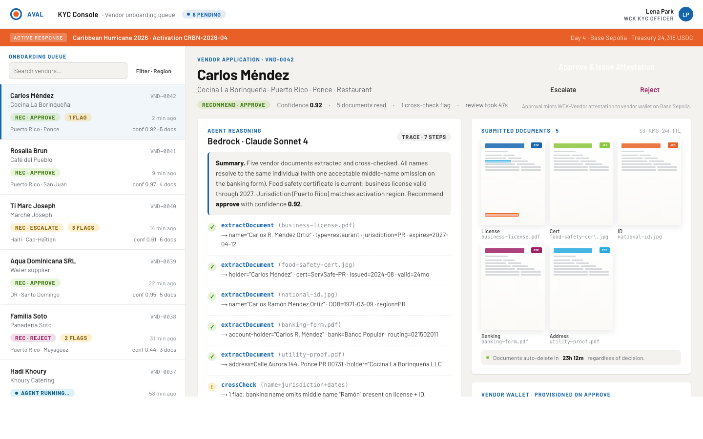
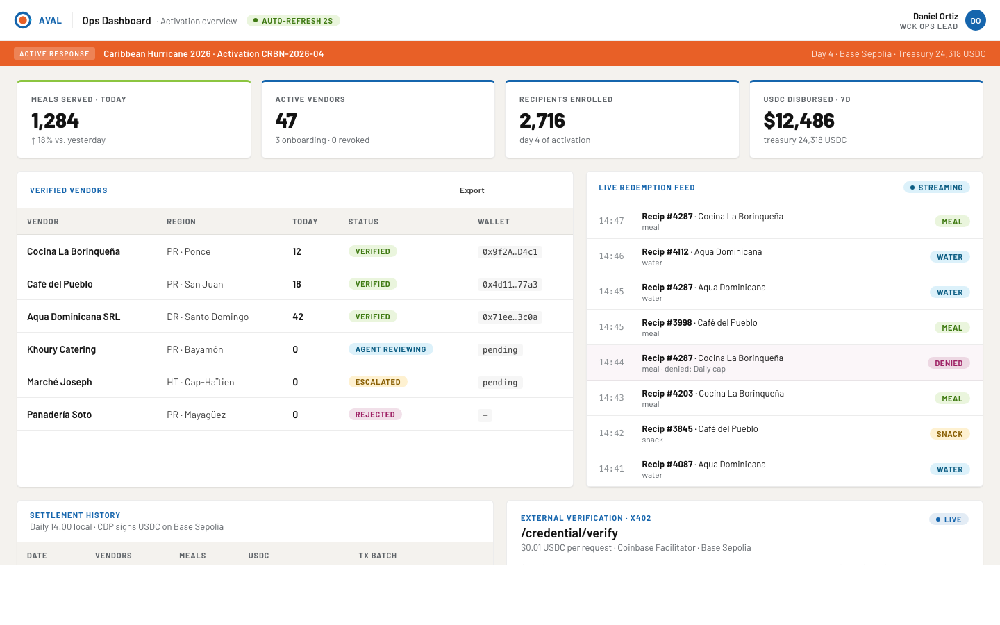
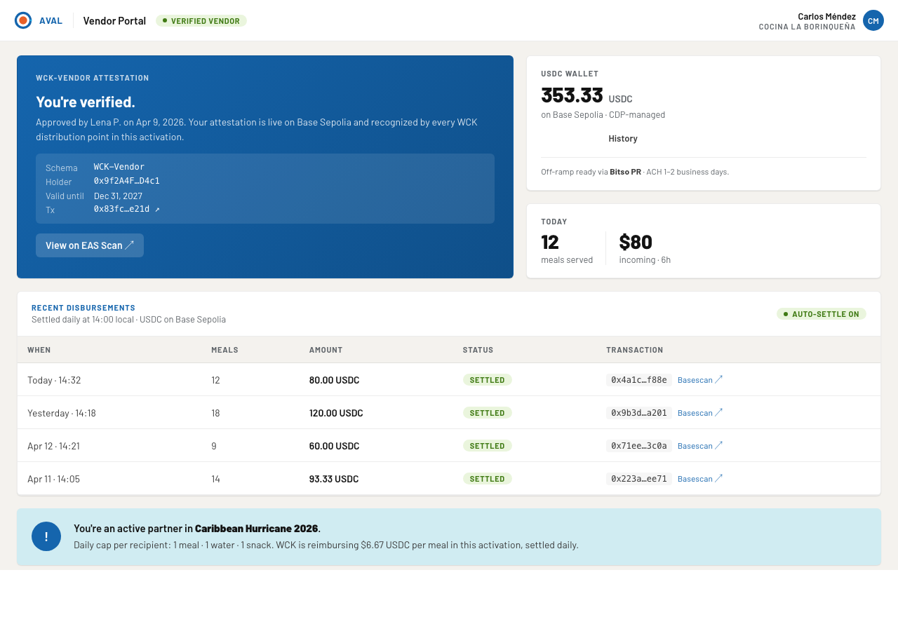
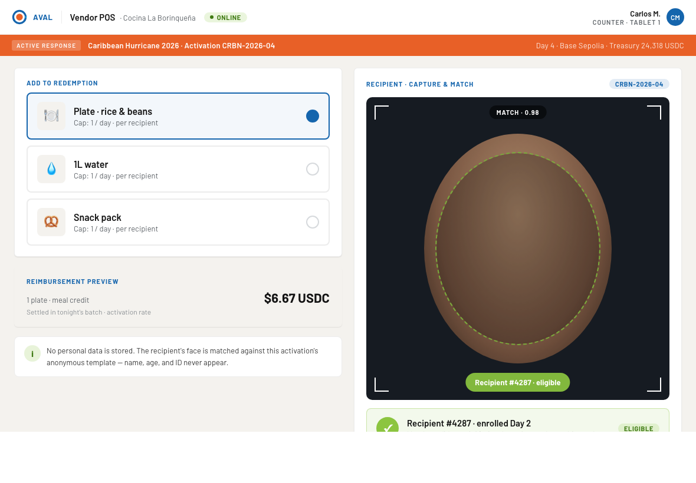
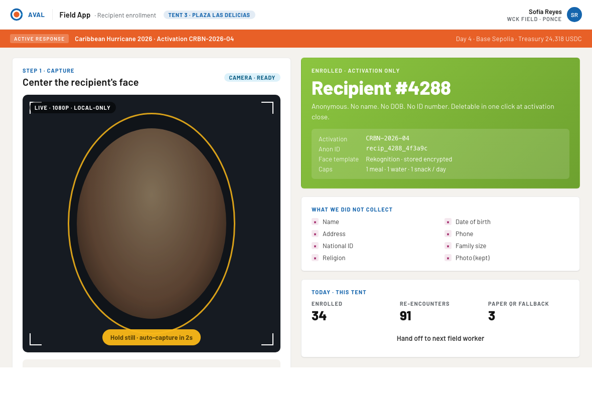
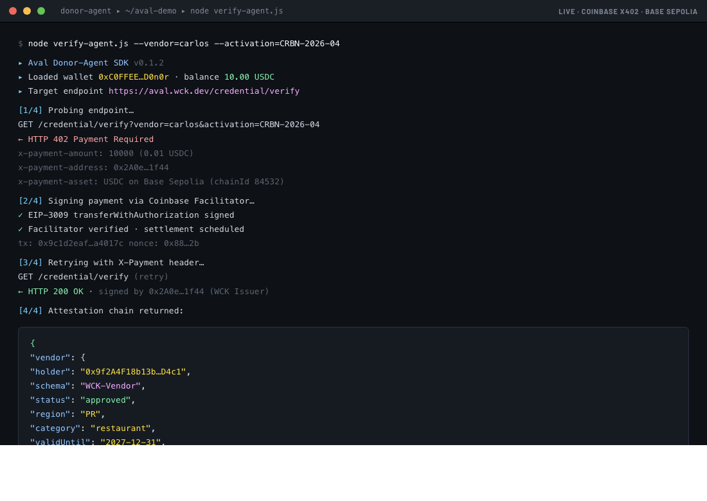
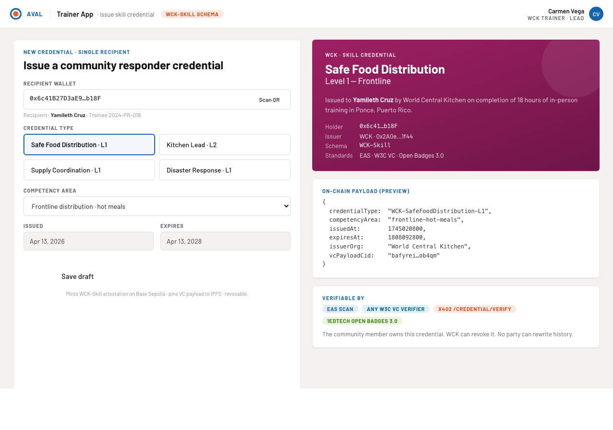

# Aval

**Identity, credential, and agent-native infrastructure for community-led humanitarian response.**

Built for [EasyA × Consensus Miami 2026](https://easya.io) — Coinbase + AWS track.

---

## Demo

> **Demo video coming soon** — *add link here before submission*

> **Approach walkthrough (with captions)** — *add link here before submission*

---

## Screenshots

### KYC Console — Agentic Vendor Onboarding

*Amazon Bedrock reviews documents; KYC officer clicks Approve to issue an EAS attestation on Base Sepolia.*
[Live →](https://main.d24eib7kys2jha.amplifyapp.com)

### Ops Dashboard — Activation Overview

*Real-time vendor status, live redemption feed, and one-click USDC settlement via CDP.*
[Live →](https://main.d35bwn340ibboz.amplifyapp.com)

### Vendor Portal — Credential & Balance

*Vendor sees their on-chain attestation and incoming USDC balance from WCK.*
[Live →](https://main.d36zzg5vvye65d.amplifyapp.com)

### Vendor POS — Recipient Redemption

*Scan recipient face → Rekognition matches anonymous template → daily cap enforced → meal logged.*
[Live →](https://main.d2y54nuhmkxlb9.amplifyapp.com)

### Field App — Recipient Enrollment

*Field worker captures a face; Rekognition stores an anonymous biometric template — no name, no ID.*
[Live →](https://main.d1c2jq9d48q43m.amplifyapp.com)

### x402 Terminal — Paywalled Credential Verification

*Any external agent sends $0.01 USDC via the Coinbase x402 Facilitator and receives the full attestation chain.*
[Live →](https://main.d1ndlg5b7tv2po.amplifyapp.com)

### Trainer App — Skill Credential Issuance

*WCK trainer issues a portable `WCK-Skill` credential (W3C VC / Open Badges 3.0) to a community responder.*
[Live →](https://main.d102qrwftz4j5v.amplifyapp.com)

---

## The Problem

World Central Kitchen pays local vendors — restaurants, food shops, water suppliers — in disaster zones for meals served to affected communities. Three friction points block every activation:

- **Vendors** are unbanked in the crypto sense. Onboarding requires a heavy internal workflow that captures business licenses, tax IDs, food safety certs, and banking details — creating an enormous PII custody burden and a multi-day human review bottleneck.
- **Recipients** need authentication only enough to ensure fair distribution — one person, one meal — without WCK ever needing to know their name.
- **Community responders** earn certifications that live as PDFs in inboxes, invisible to peer NGOs when the next disaster hits.

## What Aval Ships in 36 Hours

| Feature | What it does |
|---------|-------------|
| **Agentic vendor onboarding** | Amazon Bedrock + Textract reads submitted documents, cross-checks fields, and surfaces a structured review packet. KYC officer reads one screen, clicks Approve. |
| **On-chain vendor attestations** | EAS revocable attestation issued to the vendor's CDP-managed wallet on Base Sepolia. WCK keeps a pointer — not the documents. |
| **Privacy-preserving recipient uniqueness** | Face captured once, converted to an anonymous template in AWS Rekognition. No name, no DOB. One-button deletion at activation close. |
| **USDC settlement** | Verified redemptions mapped to verified vendors; disbursed in USDC on Base via CDP SDK on a schedule. |
| **x402-gated credential verification** | Any external agent hits `/credential/verify`, gets `402 Payment Required`, signs a $0.01 USDC micropayment via the Coinbase x402 Facilitator, and receives the full signed attestation chain. No API key. No subscription. |

**Stretch:** Live `WCK-Skill` credential issued to a community responder as a W3C Verifiable Credential / Open Badges 3.0 compatible payload — verifiable by any peer NGO with no Aval integration.

---

## How Blockchain Works in Aval

Aval uses **Base Sepolia** (Coinbase's L2 testnet) for all on-chain activity. Here is the exact flow for each blockchain interaction.

### 1 — Vendor wallet creation (Coinbase Developer Platform)

When a vendor is approved during onboarding, Aval calls the CDP SDK to create a **managed MPC wallet** on Base Sepolia. The vendor never holds a seed phrase; WCK holds no private key either — CDP's MPC threshold scheme splits custody. The wallet address is written into the EAS attestation as the `recipient` field.

```
KYC officer clicks Approve
  → attest-issue Lambda
    → CDP SDK: Wallet.create({ networkId: "base-sepolia" })
      → returns wallet address (e.g. 0xFa7C…7A58)
        → used as EAS attestation recipient
```

### 2 — EAS schema registration (Base Sepolia)

Four schemas were registered on the [Ethereum Attestation Service](https://base-sepolia.easscan.org) at hackathon start. Registration is a single on-chain transaction to the EAS registry contract (`0x4200000000000000000000000000000000000021` on Base Sepolia). Each schema encodes a typed ABI tuple that all attestations of that type must conform to.

| Schema UID | Name | Fields |
|------------|------|--------|
| Registered | `WCK-Vendor` | `status, region, category, validUntil, issuerNote` |
| Registered | `WCK-Activation-Recipient` | `activationId, enrolledAt` |
| Registered | `WCK-Skill` | `skillCode, level, issuedBy, validUntil` |
| Registered | `WCK-Supplier` | `supplierName, region, category` |

### 3 — Vendor attestation issuance (EAS on Base Sepolia)

Clicking **Approve & Issue Attestation** in the KYC Console sends a POST to the `/attest/issue` Lambda. The Lambda calls the Aval SDK which uses `viem` to sign and broadcast an `attest()` call to the EAS contract:

```
POST /attest/issue
  { vendorAddress, region, category, validUntil, issuerNote }
  → EAS.attest({
      schema: WCK-Vendor schema UID,
      data: {
        recipient: vendorAddress,        // CDP wallet address
        revocable: true,
        data: ABI.encode(payload),       // typed attestation fields
        expirationTime: validUntil
      }
    })
  → tx broadcast on Base Sepolia
  → returns attestation UID (e.g. 0x4a1c…f88e)
  → viewable at https://base-sepolia.easscan.org/attestation/view/<uid>
```

The attestation is **revocable** — if a vendor is later found non-compliant, WCK can call `revoke()` to invalidate it without deleting the historical record.

### 4 — USDC settlement (CDP SDK on Base Sepolia)

At the end of each operational day, the `/settle` Lambda queries DynamoDB for all verified redemptions, groups them by vendor wallet address, and sends USDC transfers via the treasury CDP wallet:

```
POST /settle { activationId: "CRBN-2026-04" }
  → query DynamoDB: redemptions for today
  → group by vendorAddress
  → for each vendor:
      CDP treasury wallet → USDC.transfer(vendorAddress, amount)
      tx broadcast on Base Sepolia
      tx receipt stored in DynamoDB
  → returns settlement batch with tx hashes
```

USDC amounts: meal = $6.67, water = $1.00, snack = $2.00 (atomic units: 6 decimals).

### 5 — x402 paywalled credential verification (Coinbase x402 protocol)

The `/credential/verify` endpoint is protected by the [x402 HTTP payment protocol](https://x402.org). This allows any autonomous agent to verify a vendor credential without an API key — they pay $0.01 USDC per call.

```
Step 1 — Agent sends GET /credential/verify?vendorAddress=0x...
  → Lambda returns HTTP 402 Payment Required
     body: { accepts: [{ scheme: "exact", network: "base-sepolia",
             maxAmountRequired: "10000", asset: USDC, payTo: receiverAddress }] }

Step 2 — Agent constructs ERC-3009 transferWithAuthorization signature
  → signs EIP-712 typed message with domain separator from USDC contract
  → encodes as base64 X-Payment header

Step 3 — Agent retries with X-Payment header
  → Lambda sends header to Coinbase x402 Facilitator for verification
  → Facilitator confirms payment authorization
  → Lambda queries EAS for latest WCK-Vendor attestation
  → returns full attestation chain + EAS scan URL
```

The x402 flow means **no API keys, no subscriptions, no rate-limit agreements** — just on-chain payment.

---

## Architecture

```
                ┌─────────────────────────────────────┐
                │  External Agents (donor, NGO, audit) │
                │  x402: 402 → pay $0.01 USDC → retry  │
                └──────────────┬──────────────────────┘
                               │
┌────────────┐  ┌────────────┐ ▼ ┌────────────┐  ┌────────────┐
│ KYC Console│  │Vendor Portal│  │ Vendor POS │  │ Field App  │
│ (review +  │  │(verify +   │  │(recipient  │  │(enroll     │
│  approve)  │  │ receive)   │  │ redeem)    │  │ recipient) │
└─────┬──────┘  └─────┬──────┘  └─────┬──────┘  └─────┬──────┘
      └────────────────┴───────────────┴────────────────┘
                               │
              ┌────────────────▼────────────────────────┐
              │  AWS API Gateway                         │
              │  Cognito JWT (internal) · x402 (external)│
              └──┬──────────┬──────────┬───────────┬────┘
                 │          │          │           │
        ┌────────▼──┐  ┌────▼────┐  ┌─▼──────┐  ┌▼──────────────────┐
        │/onboarding│  │/attest/*│  │/enroll │  │/credential/verify  │
        │  Bedrock  │  │EAS SDK  │  │/redeem │  │← x402 paywalled    │
        │  Agent +  │  │+ CDP    │  │Rekogni-│  │  returns signed    │
        │  Textract │  │ wallet  │  │  tion  │  │  attestation chain │
        └─────┬─────┘  └────┬────┘  └───┬────┘  └────────────────────┘
              │             │           │
           S3 bucket    EAS on Base  DynamoDB
           KMS-enc.     Sepolia      anon recipients
           24hr TTL     4 schemas    + redemption log
```

## Stack

| Layer | Technology |
|-------|-----------|
| On-chain attestations | [Ethereum Attestation Service](https://attest.org) on Base Sepolia |
| Vendor wallets | [Coinbase Developer Platform (CDP)](https://docs.cdp.coinbase.com) |
| USDC settlement | CDP SDK — Base Sepolia |
| External agent payments | [Coinbase x402 protocol](https://x402.org) (`x402-express` / `x402-fetch`) |
| Agentic document review | Amazon Bedrock Agents (Claude Sonnet 4) + AWS Textract |
| Document staging | S3 + KMS encryption + 24hr lifecycle |
| Recipient face matching | AWS Rekognition Collections |
| Redemption ledger | DynamoDB |
| Auth | Amazon Cognito (5 role groups) |
| Frontend | React + Tailwind, hosted on AWS Amplify |

## EAS Schemas (registered at H+0 on Base Sepolia)

| Schema | Status | Purpose |
|--------|--------|---------|
| `WCK-Vendor` | Active (demo) | Verified WCK partner vendor |
| `WCK-Activation-Recipient` | Registered | Optional on-chain commitment for recipient enrollment |
| `WCK-Skill` | Stretch | Portable community responder credential — W3C VC / Open Badges 3.0 |
| `WCK-Supplier` | Future | Upstream supply chain partners |

## The Agent Boundary

Aval puts agents on the **read side** and **document-review side** only.

- The Bedrock onboarding agent **recommends** approval — it cannot issue an attestation.
- The USDC settlement Lambda is deterministic, not an agent — it has no judgment to exercise.
- Recipient eligibility is field-staff judgment, not algorithmic.

Every disbursement decision has a named human accountable to it. This is the design, not a limitation. See [ADR-0001](docs/adr/0001-aval-credential-arch-eas-bedrock-hitl-x402.md) for the full architectural rationale.

## Docs

- [Design Document v3](docs/design/Avak%20Design%20V3.md) — build plan, demo script, risk register, roadmap
- [ADR-0001: Multi-Layer Credential Architecture](docs/adr/0001-aval-credential-arch-eas-bedrock-hitl-x402.md)
- [ADR Index](docs/adr/README.md)

*Built with care by the Aval team at World Central Kitchen.*
